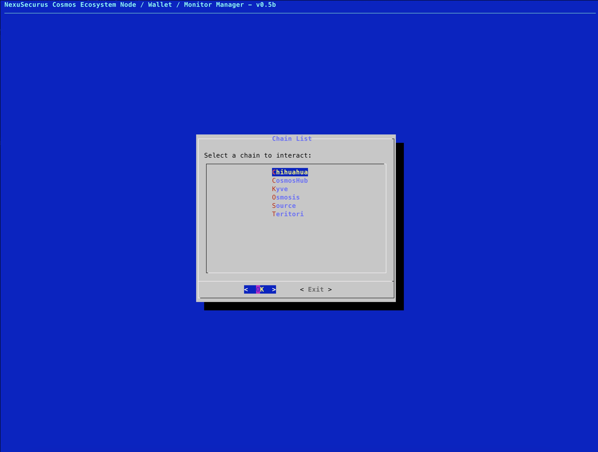
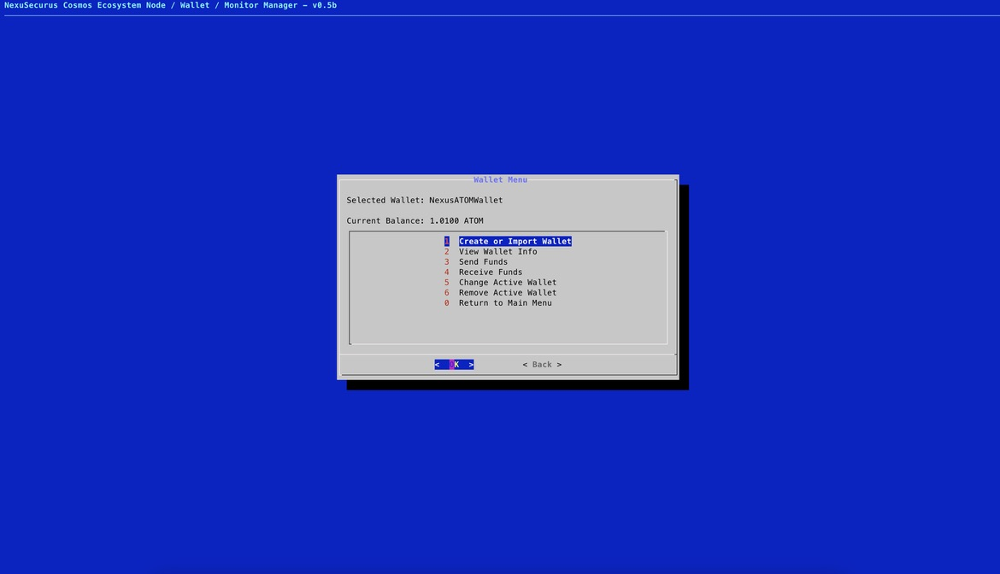

# <p align="center">Cosmos Ecosystem Node / Wallet / Monitor Manager</p> 
 <p align="center">powered by NexuSecurus&trade;</p> 


<div style="text-align:center">
    
</div>

<p align="center">
  <table>
    <tr>
      <th>Supported HW</th>
      <th>Target OS</th>
      <th>Code Stats</th>
      <th>Audience</th>
      <th>Type</th>
      <th>Dependencies</th>
      <th>License</th>
    </tr>
    <tr>
      <td></td>
      <td></td>
      <td></td>
      <td></td>
      <td></td>
      <td></td>
      <td></td>
    </tr>
    <tr>
      <td></td>
      <td></td>
      <td></td>
      <td></td>
      <td></td>
    </tr>
  </table>
</p>


<br>
<br>
<br>

## <p align="center" > IMPORTANT NOTE </p>

All functions included in this script came from chain daemon/binary, the most important one to point is WALLET SEED GENERATION, which is created using the embedded functionality within the chain app. In any situation, the seed is shared or compromised by us.

Feel free to audit the code.

<br>

---

## <p align="center" > Project Description </p>

What started has a simple script for installing nodes in the COSMOS ECOSYSTEM, came out to be a little more than just that.

The original idea wasn't this extensive, so, as you would expect, its a code with several additions and therefore not fully optimized, but, IT WORKS, HOPEFULLY ;)

This project repo aims to simplify COSMOS ECOSYSTEM Node and Validator Installations while exploring all the capabilities of the NODE, such as WALLET, MONITOR embedded commands and more. 

The program was tested even in a Ubuntu Server Minimized setup, to ensure that it would work even in the most package depleted OS.

<br>

---
<br>
<br>

## <p align="center" > Key Features </p>

#### **Menu Based Program**

<br>

**Manage Nodes**
    - Manage option like: Create, Remove, Start, Stop, Prune...  

**Wallet Included**
    - Create, Remove, Change Active Wallet, Send Funds, Receive Funds...

**Monitoring**
    - Several options to help the user assessing the Node Health Status.

**Validator Options**
    - Features like, Claim Commission Rewards and more to be included.

<br>

---
<br>
<br>


### <p align="center"><a name="table-of-contents"></a>Table of Contents</p>
<br>

- [Cosmos Ecosystem Node / Wallet / Monitor Manager](#cosmos-ecosystem-node--wallet--monitor-manager)
  - [ IMPORTANT NOTE ](#-important-note-)
  - [ Project Description ](#-project-description-)
  - [ Key Features ](#-key-features-)
      - [**Menu Based Program**](#menu-based-program)
    - [Table of Contents](#table-of-contents)
  - [ Program Requirements ](#-program-requirements-)
  - [ Installation Procedure ](#-installation-procedure-)
      - [1 - **Dependencies and Package Requirements**:](#1---dependencies-and-package-requirements)
      - [2 - **Clone the repository into your machine**:](#2---clone-the-repository-into-your-machine)
      - [3 - **Make the script file executable**:](#3---make-the-script-file-executable)
      - [4 - **Change /Chains/"ChainFile".txt**](#4---change-chainschainfiletxt)
  - [Additional information / Documentation **(MUST READ!!!)**](#additional-information--documentation-must-read)
  - [Usage](#usage)
  - [KNOWN Issues \& Bugs:](#known-issues--bugs)
  - [Screenshots](#screenshots)
  - [ About the Author ](#-about-the-author-)
  - [ Contribute To Our Effort ](#-contribute-to-our-effort-)


<br>

---
<br>
<br>


## <p align="center" > Program Requirements </p>
<br>

    - Ubuntu based Linux OS (Wre recommend Ubuntu Server Minimized, to avoid unnecessary software cluttering)
    - 2 vCPUs Minimum for Nodes (4 vCPUs recommended or more)
    - 4 VCPUs Minimum for Validators (Above 4.0GHz, under that 8 vCPUs recommended or more)
    - 6GB RAM Minimum for Nodes (we recommend 8GB RAM or more)
    - 16GB RAM Minimum for Validators (Strongly recommend 32GB RAM)
    - 60GB to 500GB Disk Space (Depending on Node Type, and Pruning Strategy)
    - Internet Connection ;

<br>

## <p align="center" > Installation Procedure </p>
<br>

#### 1 - **Dependencies and Package Requirements**:  

  All dependencies and required packages for the correct execution of this program, will be installed when the script is executed for the first time.


<br>


#### 2 - **Clone the repository into your machine**: 
Clone this repository to your machine using the following commands:

```bash
    git clone https://github.com/nexusecurus/cosmosnodeman.git
```


<br>


#### 3 - **Make the script file executable**:
For the script to be executed, you must add execution permission to the file:

```bash
    chmod +x setup.sh
```


<br>


#### 4 - **Change /Chains/"ChainFile".txt**


        Open the chain file under [Chains](/chains/) of the chain you want to interact, and edit the VARIABLES that match your desire, such as:


            - MONIKER ; (MUST CHANGE TO THE MONIKER YOU WANT TO USE FOR YOUR NODE)
            - PORT_PREFIX ; ( Default: 266 )
            - DAEMON_HOME ; (Default: $HOME )


        And if you want to install a different version of the Chain Binary:

            - BIN_VER ;
  
  
        All other VARIABLES should not be changed or it will make the program to malfunction.
        

<br>

---

<br>


## Additional information / Documentation **(MUST READ!!!)**
<br>
This section contains crucial information on what files need to be present for the program to work, in case you dont want to clone the full repo. 

<br>

The main program file is [setup.sh](/setup.sh), but it will not present any chains to interact with when executed, if the [Chains](/chains/) folder is not present in the same directory of the main program. 


---

<br>


## Usage
<br>

**Fresh Install**

After cloning the repository and making the program file executable as instructed above, the only remaining is the program execution.

<br>

Run the following command inside nexusnodes directory:

```bash
    ./setup.sh
```

<br>

**Already Existent Nodes**

If you have already an installed NODE on your system, first of all you need to assure that a .txt file named as the Chain name EX: Cosmos.txt, and inside that file, the following VARS are correctly declared:

    - MONIKER - # Add your MONIKER NODE name.
    - PORT_PREFIX - # (Default: 266) If you are using custom ports change this.
    - DAEMON_HOME - # (Default: $HOME) If you installed your previous node in a different directory, change this.
    - CHAIN_DIR - # (Default: ."chain"d) If you renamed it, please change this.


Then you can run the program with the above command.


<br>

---

<br>


## KNOWN Issues & Bugs:

<br>

There are some random exits from the program from time to time. Outside that, it does its job relatively well.

---

<br>

## Screenshots

<div style="display: flex; justify-content: center;">
    
    
    
    
</div>
<br>
</div>
<br>
<div style="display: flex; justify-content: center;">
    
    
    
    
</div>
<br>

---
<br>
## <p align="center" > About the Author </p>
<br>

- Organization: NexuSecurus
- Author: prenats
- Contact: renato@nexusecurus.com
- Year: 2023  


 <br>

---


<br>

## <p align="center" > Contribute To Our Effort </p>

<br>

<br>
<table align="center">
  <tr>
    <th>Asset</th>
    <th>Address</th>
  </tr>
  <tr>
    <td>CosmosHub</td>
    <td>cosmos1ravucs2erl88yn07eyudkhzekswcyw8mhy5lpc</td>
  </tr>
  <tr>
    <td>Osmosis</td>
    <td>osmo1ravucs2erl88yn07eyudkhzekswcyw8mll80h2</td>
  </tr>
  <tr>
    <td>AKASH</td>
    <td>akash1ravucs2erl88yn07eyudkhzekswcyw8m6leccz</td>
  </tr>
  <tr>
    <td>Source Protocol</td>
    <td>source1ravucs2erl88yn07eyudkhzekswcyw8m3hdp3x</td>
  </tr>
  <tr>
    <td>Teritori</td>
    <td>tori1ravucs2erl88yn07eyudkhzekswcyw8m4srk6g</td>
  </tr>
</table>

<br>
<br>


<div style="text-align:center">
    
</div>

